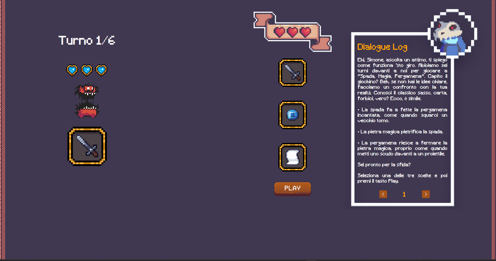

# Rock Paper Scissor Variant

This is a variant of the Rock-Paper-Scissors game created using **HTML**, **CSS**, and vanilla **JavaScript**. After one week of learning JavaScript, I challenged myself by developing this simple game with a colorful user interface.

The game is playable online: https://okamita.github.io/Rock-Paper-Scissor-Game/

## Graphics
As my first mini project, I wanted to delve into HTML alongside CSS and JavaScript to familiarize myself and explore the possibilities firsthand. Therefore, I decided to enhance the Rock-Paper-Scissors game with UI and graphics, given that I had already implemented it using the command console.

I had to modify several graphical elements in Figma. While I understand that this may not be the primary objective or the most efficient use of CSS and HTML, I still wanted to create something visually striking, which proved to be a challenge in itself.

  

## Challenges

The main challenges I faced with this mini project revolved around managing it effectively while implementing features and animated graphical elements sequentially. I found myself encountering several issues during implementation because I added features as they came to mind without a clear preliminary design plan.

  

Dal prossimo progetto cerceró di approcciarmi al progetto in modo piú serio e creero un design e delle fasi preliminari in modo da rendere l'implemntazione piú semplice. Inoltre dal prossimo progetto utilizzeró git di piú, pensando che fosse un progetto veloce non ho creato una repository fino alla fine, cosa sbagliata. 

## Stats
The project took me about 20 hours to complete. Most of the time was spent trying to refresh my memory of HTML and CSS, which I studied a year ago. A significant portion of time was also spent searching for graphics online and modifying them. Without a prototype, I spent a lot of time tweaking already implemented features.

Additionally, it's worth mentioning that I'm aware of some bugs. The game also has some graphical glitches where the demon gif is located. I had wanted to implement more features, such as monster death animation or other parts of the storyline, but I didn't want to invest more time into this project. The code needs a complete overhaul and is very messy and disjointed. However, since this was a project to test what I had learned, my focus was more on implementing as much as possible rather than making it presentable for GitHub and anyone who views this project.

## Disclaimer
All assets utilized are sourced from royalty-free repositories available online, with a significant portion discovered on itch.io. Gratitude is extended to all creators who generously shared these assets. Regrettably, specific sources of downloaded assets were not retained.